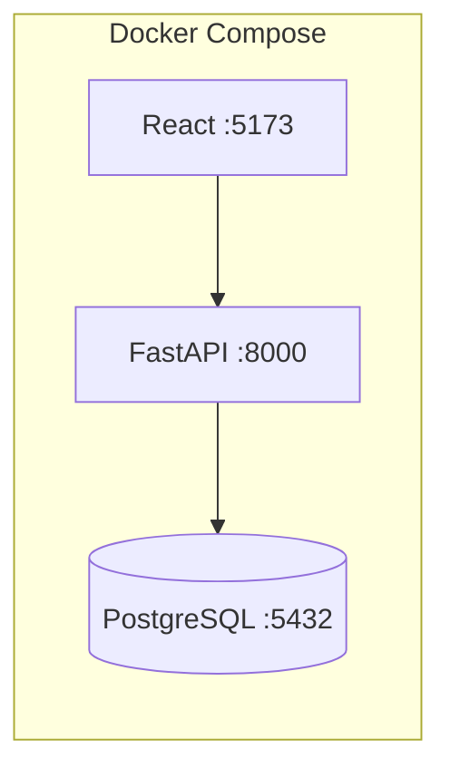

# Inventory & Sales Reporting System

A zero-cost, production-style inventory and sales reporting platform built with FastAPI, PostgreSQL, React, and Docker Compose. Runs fully locally — no paid services required.

**Stack:** FastAPI · PostgreSQL · React · Docker Compose · SQLAlchemy · Pandas · Pytest · Recharts

---

## Role Relevance

| Role | What This Project Demonstrates |
|------|-------------------------------|
| **Application Developer** | Full business workflow: products, inventory, sales, reporting |
| **Backend Developer** | REST API, transactional stock updates, service-layer architecture |
| **SQL Developer** | 8 SQL aggregation reports, schema design, indexing strategy |
| **Full Stack Developer** | React dashboard with charts, CRUD pages, Dockerized deployment |
| **Data Analyst / BI** | Revenue analytics, profit margins, CSV exports, dashboard visualizations |

---

## Features

- **Product Management** — CRUD, search, category filter, soft deactivation
- **Supplier Management** — Vendor catalog linked to products
- **Inventory Tracking** — Stock-in, stock-out, adjustments, movement audit trail
- **Sales Transactions** — Multi-item sales with automatic inventory reduction
- **Oversell Prevention** — Transactional stock checks block insufficient-stock sales
- **8 SQL Reports** — Revenue, profit, low-stock, top products, monthly trends, valuation, supplier performance
- **CSV Exports** — Sales, inventory, and low-stock data downloads
- **React Dashboard** — Revenue charts, stat cards, recent sales, interactive pages
- **Deterministic Seed Data** — 10 suppliers, 100 products, 500 sales for instant demos
- **Test Suite** — 30+ pytest tests covering CRUD, inventory, sales, reports, exports

---

## Architecture



See [docs/ARCHITECTURE.md](docs/ARCHITECTURE.md) for detailed diagrams and flows.

---

## Quick Start

### Prerequisites

- Docker and Docker Compose
- Make (optional, for convenience commands)

### Run Everything

```bash
cd inventory-sales-reporting-system

# Start all services
make up

# Seed the database with demo data
make seed
```

### Access

| Service | URL |
|---------|-----|
| **Dashboard** | http://localhost:5173 |
| **API** | http://localhost:8000 |
| **Swagger Docs** | http://localhost:8000/docs |
| **PostgreSQL** | localhost:5432 (user: `inventory`, pass: `inventory`, db: `inventory_db`) |

### Makefile Commands

```bash
make up       # Start all containers
make down     # Stop containers
make seed     # Load demo data
make test     # Run pytest suite
make logs     # Tail container logs
make reset    # Destroy volumes, rebuild, and re-seed
```

---

## API Examples

```bash
# Health check
curl http://localhost:8000/health

# List products
curl http://localhost:8000/products

# Search products
curl "http://localhost:8000/products?search=Widget&category=Electronics"

# Create a sale
curl -X POST http://localhost:8000/sales \
  -H "Content-Type: application/json" \
  -d '{"payment_method":"CASH","items":[{"product_id":1,"quantity":2}]}'

# Sales summary report
curl http://localhost:8000/reports/sales-summary

# Export sales CSV
curl -o sales.csv http://localhost:8000/exports/sales.csv
```

Full API reference: [docs/API.md](docs/API.md)

---

## Seed Data

The seed script generates deterministic demo data:

| Entity | Count |
|--------|-------|
| Suppliers | 10 |
| Products | 100 |
| Inventory records | 100 |
| Sales | 500 |
| Stock movements | 600+ |

```bash
make seed
# or directly:
docker compose exec backend python -m app.seed.seed_data
```

---

## Testing

```bash
make test
# or:
docker compose exec backend pytest tests/ -v
```

Tests cover:
- Health endpoint
- Product CRUD and validation
- Inventory stock-in/out/adjust
- Sale creation and inventory reduction
- Oversell prevention
- All 8 report endpoints
- CSV export endpoints

---

## Project Structure

```
inventory-sales-reporting-system/
├── README.md
├── docker-compose.yml
├── .env.example
├── Makefile
├── backend/
│   ├── app/
│   │   ├── main.py
│   │   ├── api/          # Route handlers
│   │   ├── models/       # SQLAlchemy models
│   │   ├── schemas/      # Pydantic schemas
│   │   ├── services/     # Business logic
│   │   └── seed/         # Demo data generator
│   └── tests/
├── frontend/
│   └── src/
│       ├── api/          # API client
│       ├── components/
│       └── pages/        # Dashboard, Products, Inventory, Sales, Reports
└── docs/
    ├── ARCHITECTURE.md
    ├── API.md
    ├── DATABASE_SCHEMA.md
    ├── SQL_REPORTS.md
    ├── SCREENSHOTS_GUIDE.md
    └── RESUME_BULLETS.md
```

---

## Documentation

- [Architecture & Flow Diagrams](docs/ARCHITECTURE.md)
- [Database Schema & ER Diagram](docs/DATABASE_SCHEMA.md)
- [SQL Reports Explained](docs/SQL_REPORTS.md)
- [API Reference](docs/API.md)
- [Screenshots Guide](docs/SCREENSHOTS_GUIDE.md)
- [Resume Bullets](docs/RESUME_BULLETS.md)

---

## Resume Positioning

**Title:** Inventory & Sales Reporting System

**Subtitle:** FastAPI, PostgreSQL, React, Docker Compose, SQL Analytics

> Built a local inventory and sales reporting system with transactional stock updates, SQL-backed analytics, CSV exports, and Dockerized full-stack services.

See [docs/RESUME_BULLETS.md](docs/RESUME_BULLETS.md) for role-specific bullets.

---

## Zero-Cost Note

This project uses only free, open-source, locally runnable tools:

- **PostgreSQL** — open-source database
- **FastAPI + Uvicorn** — open-source Python web framework
- **React + Vite** — open-source frontend tooling
- **Recharts** — open-source charting library
- **Docker Compose** — local container orchestration
- **Pandas** — open-source data export

No cloud accounts, API keys, or credit cards required.
