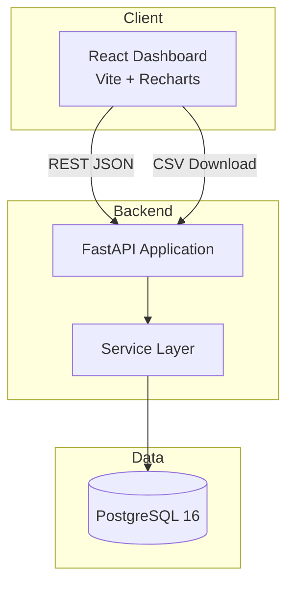
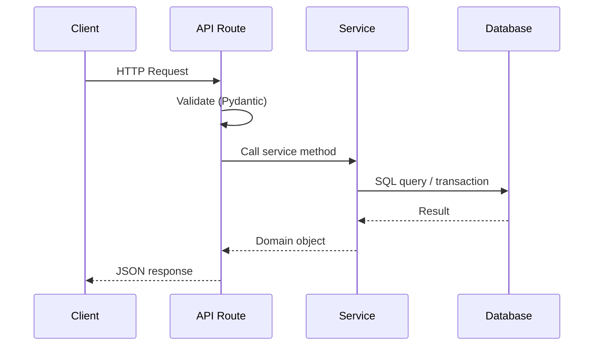
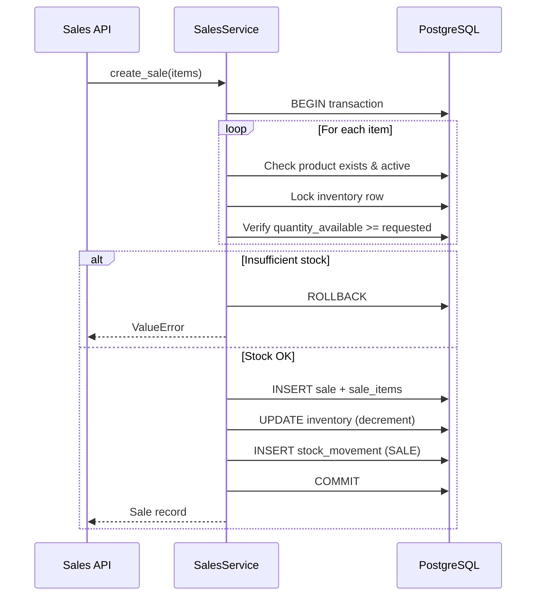
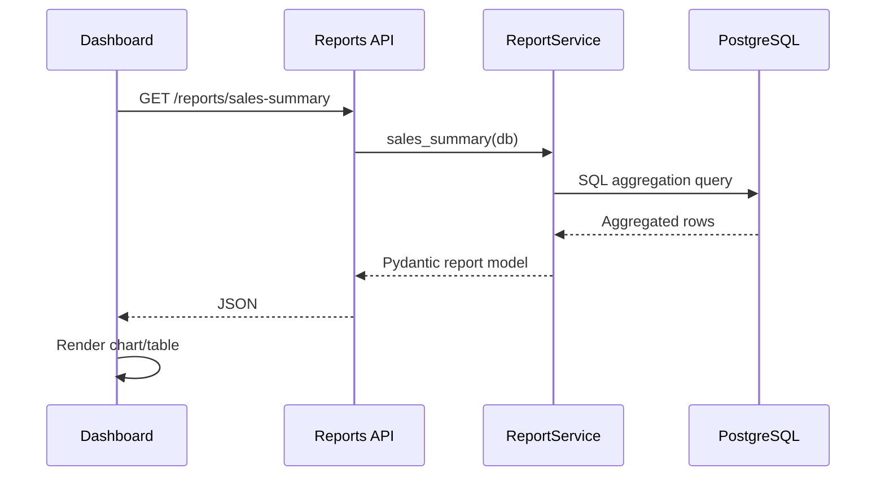

# Architecture

## System Overview

## Backend Layers

| Layer | Responsibility |
|-------|---------------|
| **API Routes** | HTTP endpoints, request validation, error responses |
| **Services** | Business logic, transactions, stock enforcement |
| **Models** | SQLAlchemy ORM table definitions |
| **Schemas** | Pydantic request/response validation |

## Backend Request Flow

## Inventory Update Transaction Flow

## Sales Reporting Flow

## Key Design Decisions

1. **Transactional sales** — All sale creation happens in a single database transaction. Stock is checked and decremented atomically to prevent overselling.

2. **Stock movement audit trail** — Every inventory change (stock-in, sale, adjustment, return) creates a `stock_movements` record for traceability.

3. **SQL-backed reports** — Analytics endpoints use raw SQL aggregation queries against PostgreSQL, demonstrating SQL developer skills.

4. **Deterministic seed data** — Fixed random seed (42) ensures reproducible demo data across environments.

5. **Zero-cost stack** — All components run locally via Docker Compose with open-source tools only.
